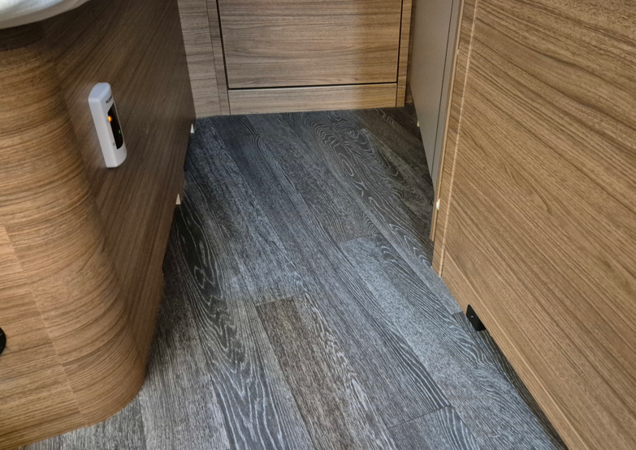
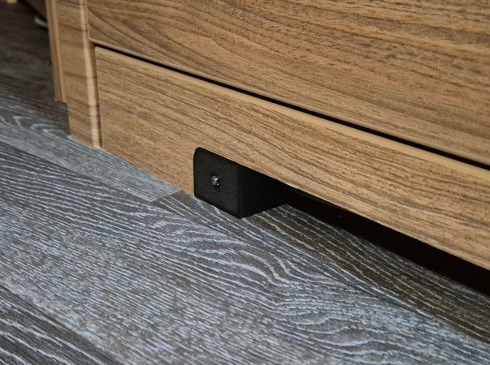
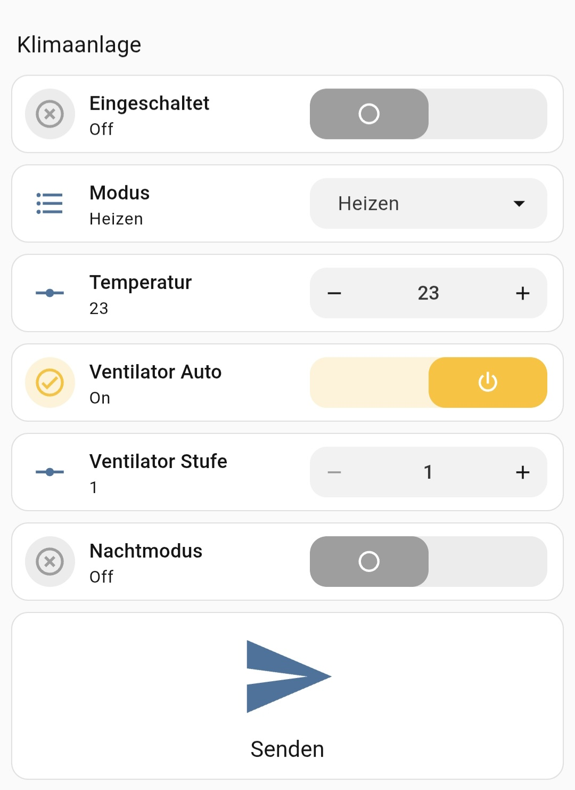
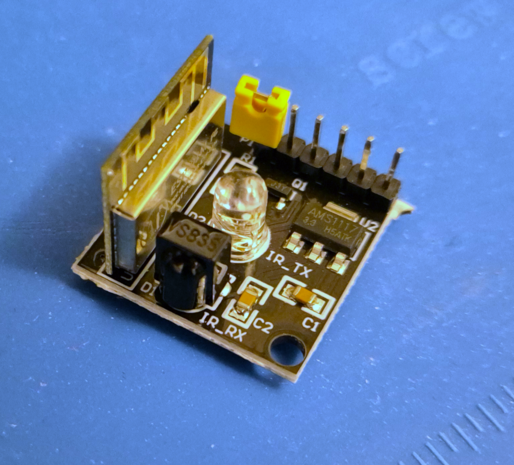

# Dometic-FWX4-IR-Sender-Homeassistant

This repo enables you to control your Dometic FWX4 (former Freshwell 3000) over Homeassistant remotely.
Based on ESPHome with Homeassistant.

The sender sits on the right bottom and targets to the receiver of the FWX4.

## Basics
The helpers are shown on the Dashboard.
The Button starts the Script that greps the data and sends an action to the ESP.
The ESP has the firmware from ESPHome Builder on it.

## Code for ESPHome Builder
See **fwx4-ir-transmitter.yaml**

## Script in Homeassistant
Needed for start sending the infrared signal after clicking the button.
See **scripts.yaml**

## Helper in Homeassistant
|name|type|range
|-|-|-|
|fwx4_ac_power|Input boolean|0-1
|fwx4_mode Input|select|"Heizen", "Kühlen", "Entfeuchten", "Umluft", "Auto"
|fwx4_nightmode|Input boolean|0-1
|fwx4_temperature|Input number|16-31
|fwx4_ventilator_auto|Input boolean|0-1
|fwx4_ventilator_speed|Input number|1-3

## Dashboard
Just arrage and use the helpers as you want.
Example see in **dashboard.yaml**

## Hardware
"ESP8285 ESP-01M IR Sender und Empfänger"

## Housing for Hardware
My solution: https://makerworld.com/de/models/2528075-ir-sender-box-for-dometic-fwx4-remote-control#profileId-2781943

The infrared LED must be unsoldered from the board. The LED is connected by short wires to the board afterwards. Now the LED is inserted and fixed with hot glue. This has the advantage, that the LED faces upwards to the receiver for better transmission. The board fits into the box and must be supplied. I used a long USB cable and plugged it into the raspberry running homeassistant.
